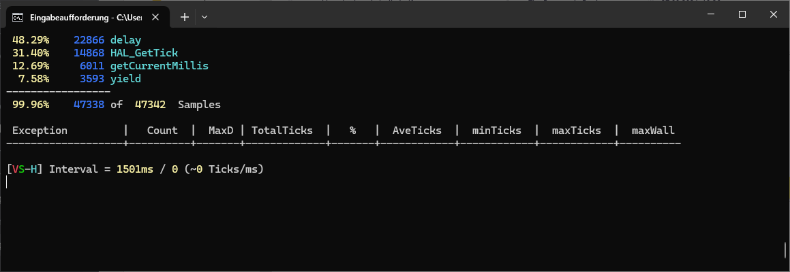

# STM32L4 Trace

## References
* https://github.com/orbcode/orbuculum
* https://github.com/orbcode/libtrace
* https://github.com/orbcode/orbuculum/actions/workflows/build-windows.yml

## What is this?

This is an example of how to make use of the Cortex-M4's tracing capabilities, specifically periodic sampling of the PC (program counter) register and outputting it via SWO with the UART (NRZ) encoding at 2 million baud, and then post-processing those files. You can thus find out in which functions the CPU spends its time executing code. See also: statistical profiling.

The firmware sets up the DWT, ITM and TPIU to sample the PC every 64 clock cycles. The board is clocked at 80 MHz. The SWO baud rate is chosen to the maximum that the on-board ST-Link V2 can support: 2MHz.

## How to use

1. Upload prepared firmware via PlatformIO as regular
2. Connect to the board using OpenOCD and tell it to output the SWO data (with the appropriate CPU clock and trace pin frequency) to localhost:3443
```
C:\Users\Max\.platformio\packages\tool-openocd\bin\openocd -d2 -f interface/stlink.cfg -f target/stm32l4x.cfg -c "tpiu config internal :3443 uart off 80000000 2000000"
```
3. Start `orbtop` with the `firmware.elf` elf file and some options

```
C:\Users\Max\Downloads\orbuculum-win64\bin\orbtop.exe -e "C:\Users\Max\temp\l4_trace\.pio\build\nucleo_l476rg\firmware.elf"  -n -o live.txt -r routines.txt -g record.txt -E  -I 2000
```


